# Portfolio App — Architecture & Page Flow Reference

> **Stack**: Spring Boot 4.0.2 (Java 17) · PostgreSQL 15 · Redis (Lettuce) · Vanilla JS · Nginx
> **Last updated**: April 21, 2026
> **Repo**: This doc lives in `Portfolio-Backend`. Frontend repo: `portfolio-frontend`

---

## Table of Contents

1. [System Architecture](#1-system-architecture)
2. [Database Schema](#2-database-schema)
3. [API Endpoint Reference](#3-api-endpoint-reference)
4. [Page Flow & User Journey](#4-page-flow--user-journey)
5. [API Data Flow — Sequence Diagrams](#5-api-data-flow--sequence-diagrams)
6. [Transition & Animation Design](#6-transition--animation-design)
7. [Graceful Degradation](#7-graceful-degradation)
8. [Developer Quick Reference](#8-developer-quick-reference)

---

## 1. System Architecture

### 1.1 High-Level Overview

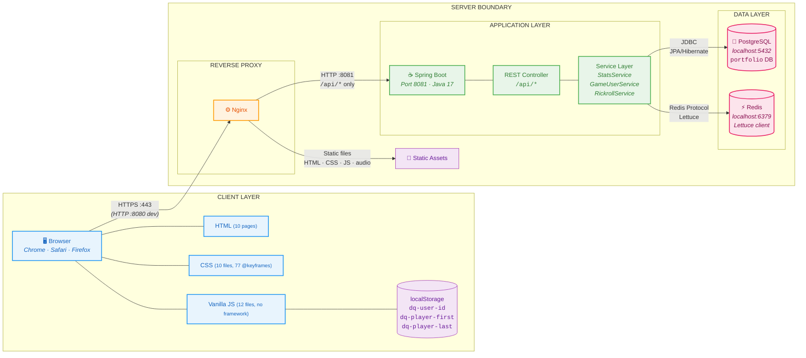

### 1.2 Architecture Notes

| Layer | Technology | Port | Notes |
|-------|-----------|------|-------|
| Client | Vanilla HTML/CSS/JS | — | No build step, no bundler, no framework. `fetch()` for API calls |
| Reverse Proxy | Nginx | 443 (prod) / 8080 (dev) | Routes `/api/*` to Spring Boot, serves everything else as static |
| Application | Spring Boot 4.0.2 | 8081 | Java 17, Lombok, Jakarta Validation, Spring Data JPA + Redis |
| Relational DB | PostgreSQL | 5432 | Single table (`game_user`), Hibernate DDL auto-update |
| Cache | Redis | 6379 | Lettuce client, optional SSL, env var config for cloud deploy |

**CORS Configuration** — `CorsConfig.java`:
- Allowed origins: `localhost:5500`, `127.0.0.1:5500`, `localhost:3000`, `localhost:8080`
- Allowed methods: `GET`, `POST`, `PUT`, `OPTIONS`
- Allowed headers: `*`
- Mapping: `/**`

---

## 2. Database Schema

### 2.1 Entity Relationship Diagram

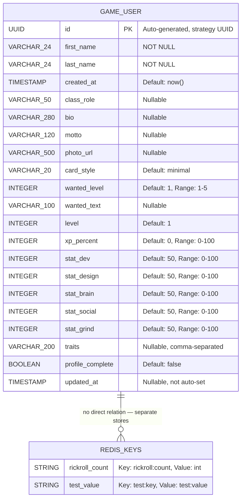

### 2.2 Schema Notes

- **Single table design** — `game_user` holds identity + card customization + stats in one entity
- **Traits storage** — Comma-separated string in DB, split to `List<String>` in response DTO
- **Stats** — 5 fixed integer columns (DEV, DESIGN, BRAIN, SOCIAL, GRIND), mapped to `LinkedHashMap<String, Integer>` in response
- **No foreign keys** — Redis keys are independent; no relational joins
- **User lookup** — `findByFirstNameAndLastName()` derived query (case-sensitive, no unique constraint)
- **`updated_at` not auto-set** — Service layer does not call `setUpdatedAt()` on save. Needs manual fix if timestamp tracking is desired
- **DDL** — `spring.jpa.hibernate.ddl-auto=update` auto-migrates schema changes

---

## 3. API Endpoint Reference

### 3.1 Endpoint Map

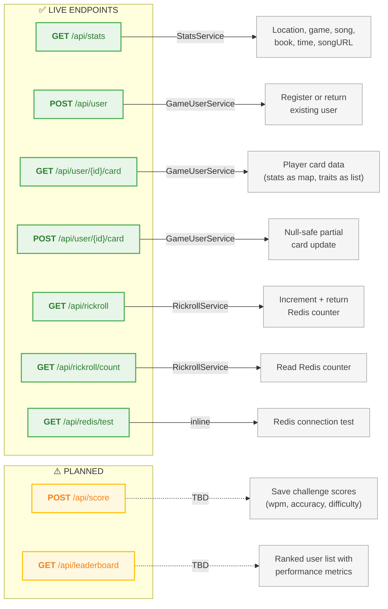

### 3.2 Endpoint Details

#### `GET /api/stats` — Portfolio live data
```
Response: {
  "location":    "Hyderabad",                    // from application.properties
  "game":        "Counter Strike 2",             // from application.properties
  "currentTime": "2:30pm",                       // LocalTime.now() formatted
  "timeStamp":   1713700000000,                  // System.currentTimeMillis()
  "songName":    "a banger",                     // from application.properties
  "songURL":     "/audio/ManMazeUmalunGele.mp3", // rotates every 4 hours (hour/4)
  "bookName":    "Fundamentals of Microcontrollers and MicroProcessors"
}

Song rotation: slot = hour / 4
  00-03 → Funkadelic.mp3
  04-07 → Lawrie.mp3
  08-11 → Aladeeeeen.mp3
  12-15 → ManMazeUmalunGele.mp3
  16-19 → EverybodyWantsToRuleTheWorldJoshGad.mp3
  20-23 → miMorchaNelaNahi.mp3
```

#### `POST /api/user` — User registration (register-or-get)
```
Request:  { "firstName": "Sushrut", "lastName": "Vaidya" }
Response: Full GameUser entity JSON (includes UUID id)
Error:    400 { "error": "Length is too short babe" }  (if name < 2 chars)
Logic:    findByFirstNameAndLastName → exists? return it : create new
```

#### `GET /api/user/{id}/card` — Fetch player card
```
Path:     id = UUID
Response: PlayerCardResponse {
  id, firstName, lastName, classRole, bio, motto, photoUrl,
  cardStyle, wantedLevel, wantedText, level, xpPercent,
  stats: { DEV: 50, DESIGN: 50, BRAIN: 50, SOCIAL: 50, GRIND: 50 },
  traits: ["Hyderabad", "Gamer", "Cook"],
  profileComplete, createdAt, updatedAt
}
Error:    RuntimeException("BuddyBoy your user is not registered")
```

#### `POST /api/user/{id}/card` — Partial card update
```
Path:     id = UUID
Request:  PlayerCardRequest (all fields nullable — only non-null fields update)
          Validation: @Size, @Min(0), @Max(100) on stats, @Min(1) @Max(5) on wantedLevel
Response: PlayerCardResponse (same as GET)
Note:     Uses POST but semantically is PUT (CORS allows PUT)
```

#### `GET /api/rickroll` — Increment rickroll counter
```
Response: { "count": 42 }
Storage:  Redis key "rickroll:count" → INCR
Fallback: AtomicInteger in-memory if Redis fails (permanent switch, no retry)
```

---

## 4. Page Flow & User Journey

### 4.1 Complete Site Flow

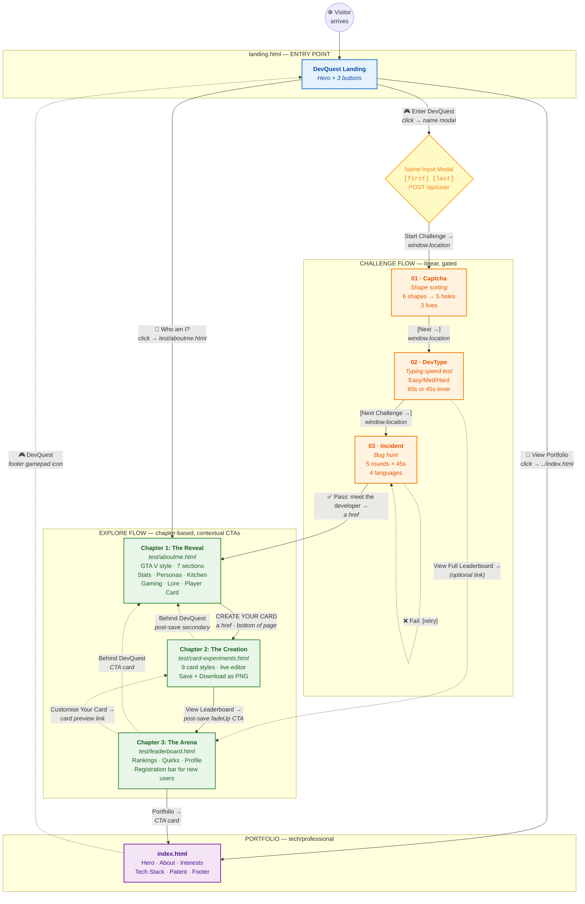

### 4.2 Page Details

| Page | File | API Calls | localStorage | Nav Bar | Registration Bar |
|------|------|-----------|-------------|---------|-----------------|
| Landing | `devquest/landing.html` | `POST /api/user` | SET: name, first, last, id | No | No (has modal) |
| Captcha | `devquest/captcha.html` | None | None | Challenge progress bar | No |
| DevType | `devquest/devtype.html` | `POST /api/score`, `GET /api/leaderboard` | GET: user-id, player-first | Challenge progress bar | No |
| Incident | `devquest/incident.html` | None | None | Challenge progress bar | No |
| About v2 | `devquest/test/aboutme.html` | None | None | **No** (immersive) | **No** |
| Card Editor | `devquest/test/card-experiments.html` | `GET /api/user/{id}/card`, `PUT /api/user/{id}/card` | GET: user-id, player-first, player-last | **No** (focused) | **No** |
| Leaderboard | `devquest/test/leaderboard.html` | `POST /api/user` (reg bar) | GET/SET: all 4 keys | **Yes** (glassmorphic) | **Yes** |
| Portfolio | `index.html` | `GET /api/stats`, `GET /api/rickroll` | sessionStorage: rickrolled | No | No |

### 4.3 Two User Paths

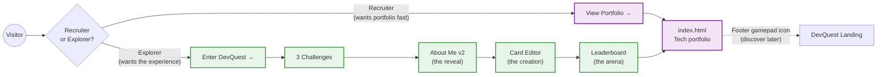

---

## 5. API Data Flow — Sequence Diagrams

### 5.1 Portfolio Stats Fetch (`GET /api/stats`)

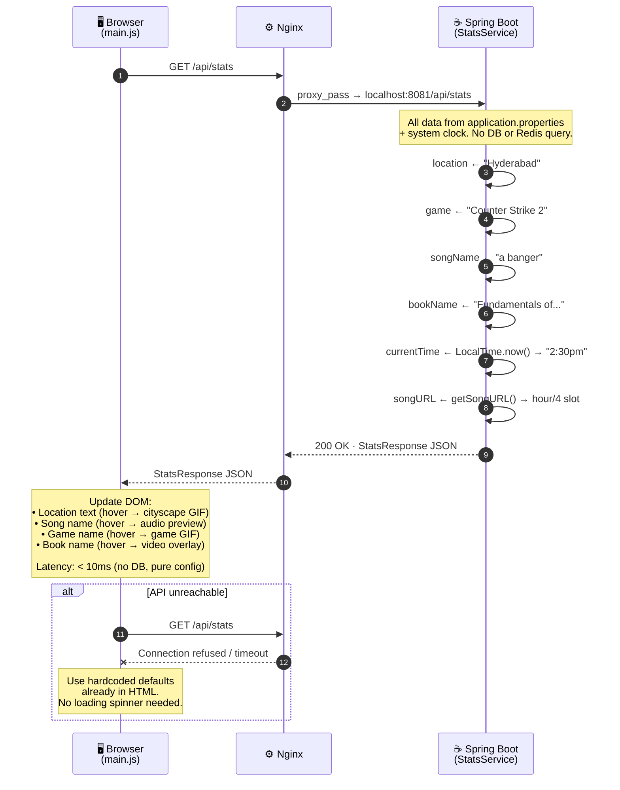

### 5.2 User Registration (`POST /api/user`)

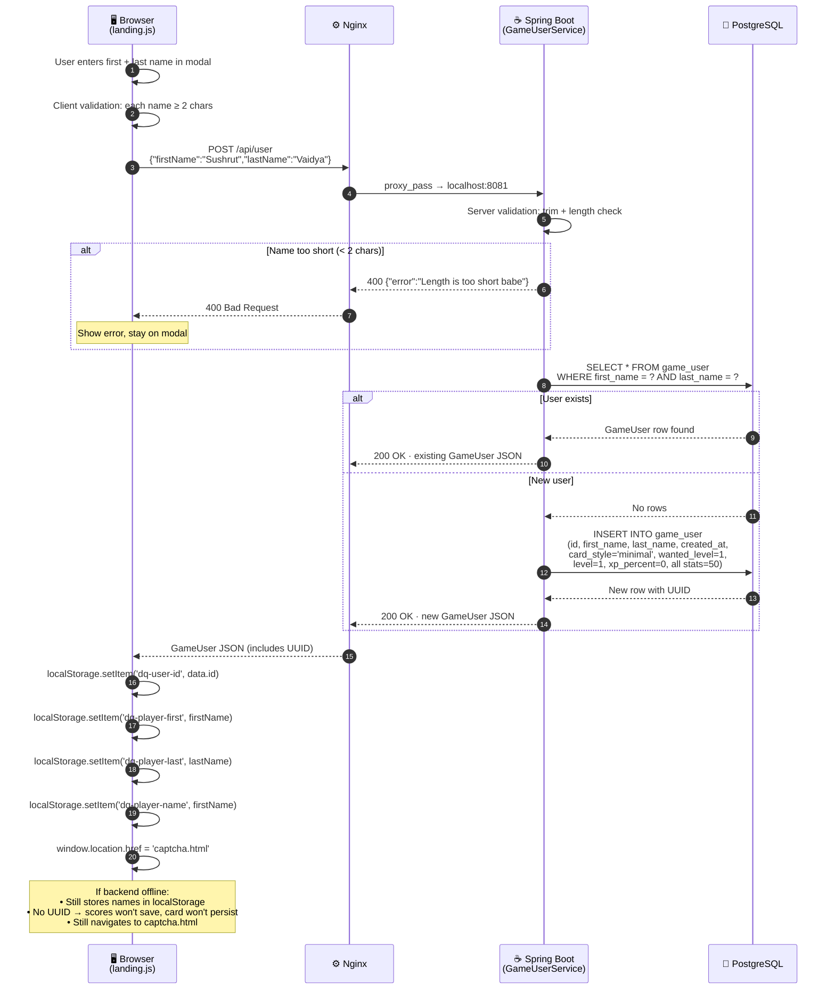

### 5.3 Player Card Save (`POST /api/user/{id}/card`)

```mermaid
sequenceDiagram
    autonumber
    participant B as 🖥️ Browser<br/>(card-experiments.html)
    participant N as ⚙️ Nginx
    participant S as ☕ Spring Boot<br/>(GameUserService)
    participant DB as 🐘 PostgreSQL

    B->>B: User customizes card:<br/>style, class, stats, traits, wanted level
    B->>B: Click [Save Card]
    B->>B: Check localStorage('dq-user-id')

    alt No user ID
        B--xB: showSaveStatus('No user ID — register first', 'error')
        Note over B: Blocked. No API call made.
    end

    B->>N: POST /api/user/{uuid}/card<br/>PlayerCardRequest JSON<br/>(only non-null fields sent)
    N->>S: proxy_pass → localhost:8081

    S->>DB: SELECT * FROM game_user WHERE id = ?

    alt User not found
        DB-->>S: No rows
        S-->>N: RuntimeException<br/>"BuddyBoy your user is not registered"
        N-->>B: 500 Error
        Note over B: showSaveStatus(err.message, 'error')
    end

    DB-->>S: GameUser row

    Note over S: Null-safe partial update:<br/>for each field in request:<br/>  if (field != null) entity.setField(field)<br/><br/>Only non-null fields overwrite.<br/>Null fields left unchanged.

    S->>DB: UPDATE game_user SET ... WHERE id = ?
    DB-->>S: Updated row

    S->>S: toResponse(entity)<br/>• stats → LinkedHashMap {DEV,DESIGN,BRAIN,SOCIAL,GRIND}<br/>• traits → split(",") → List&lt;String&gt;

    S-->>N: 200 OK · PlayerCardResponse JSON
    N-->>B: PlayerCardResponse JSON

    B->>B: showSaveStatus('Saved', 'success')
    B->>B: document.getElementById('cardNext').style.display = ''
    Note over B: "What's Next" section fades in (fadeUp 400ms)<br/>• View Leaderboard → (primary CTA)<br/>• Behind DevQuest (secondary link)
```

### 5.4 Rickroll Counter (Redis with Fallback)

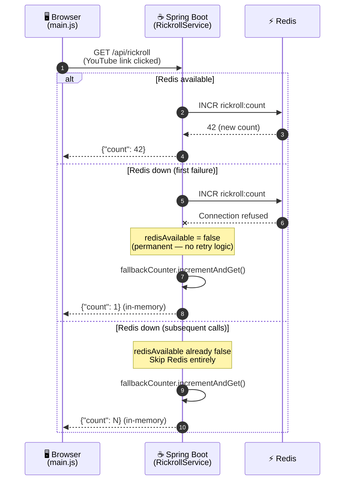

### 5.5 Future: Live Data with Redis Caching

This is the **target architecture** for when `/api/stats` evolves to pull real-time data from external APIs (Spotify, Steam, Goodreads).

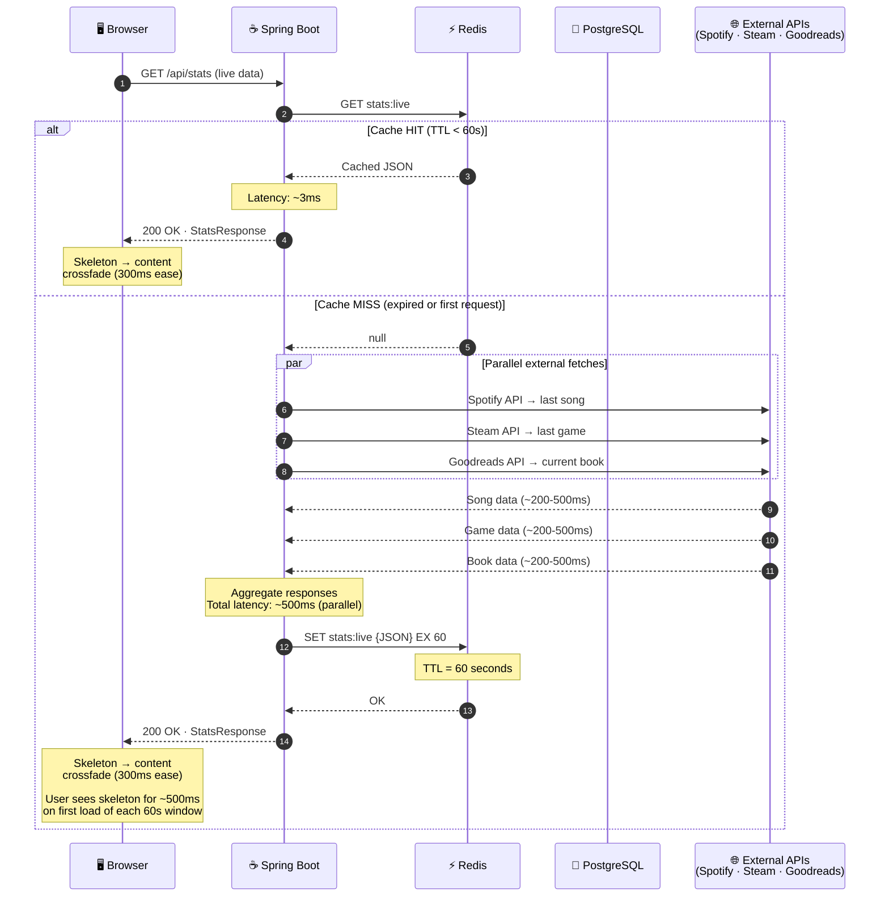

### 5.6 Card Download (Client-Side Only)

```mermaid
sequenceDiagram
    autonumber
    participant U as 👤 User
    participant B as 🖥️ Browser<br/>(card-experiments.html)
    participant H as 📦 html2canvas<br/>(CDN v1.4.1)

    U->>B: Click [Download Card]
    B->>B: Button → disabled, text → "Exporting..."

    B->>B: Create hidden off-screen container<br/>position:fixed; left:-9999px

    B->>B: Render selected card style<br/>CARD_STYLES[index].build(true)

    B->>B: Set crossOrigin='anonymous'<br/>on all  elements

    B->>B: await Promise.all(images loaded)

    B->>H: html2canvas(cardEl, {<br/>  backgroundColor: null,<br/>  scale: 2,<br/>  useCORS: true<br/>})

    H-->>B: Canvas element (2x retina resolution)

    B->>B: canvas.toBlob(blob, 'image/png')
    B->>B: URL.createObjectURL(blob)
    B->>B: Trigger <a download> click
    B->>U: PNG file downloads

    B->>B: Cleanup: remove container,<br/>re-enable button
    B->>B: showSaveStatus('Downloaded!', 'success')
    B->>B: Reveal #cardNext section (fadeUp 400ms)

    Note over B: NO API CALLS<br/>Entirely client-side.<br/>Works offline.
```

---

## 6. Transition & Animation Design

### 6.1 Animation Inventory

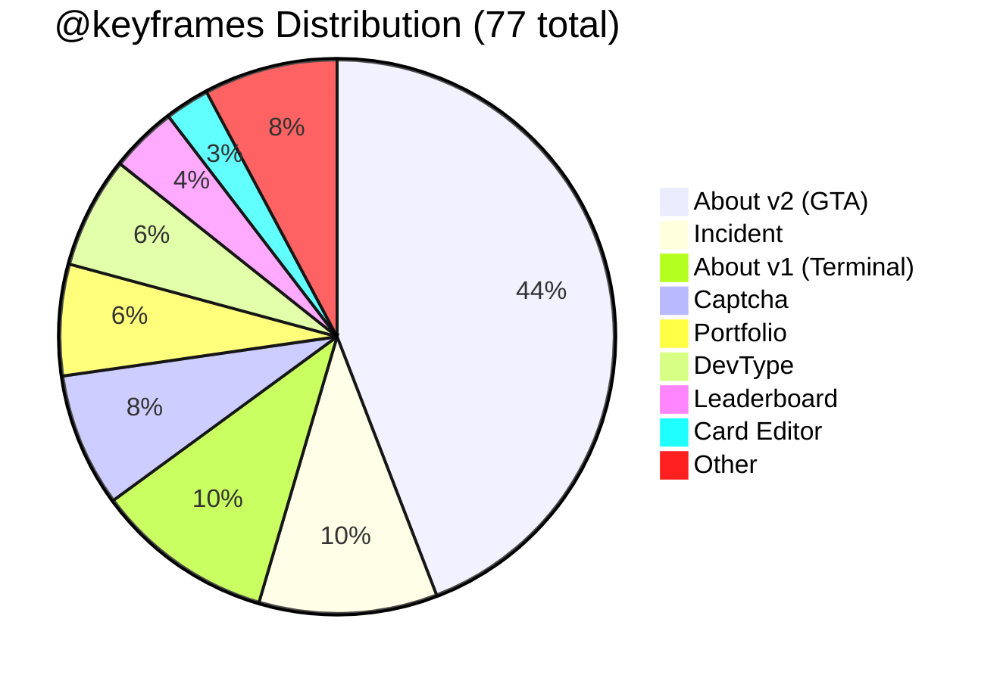

### 6.2 Transition Map

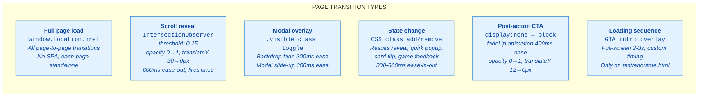

### 6.3 Per-Page Transition Spec

| Page | Entry | Duration | Easing | Key Animation |
|------|-------|----------|--------|---------------|
| `landing.html` | Direct URL load | Instant | — | Flowing orbs + grain overlay |
| Name Modal | Button click | 300ms | `ease` | Backdrop fade + modal slide-up |
| `captcha.html` | `window.location` | 600ms | `cubic-bezier(0.25,0.46,0.45,0.94)` | Shape drop-in + particle bursts (450-650ms) |
| `devtype.html` | `window.location` | 400ms | `ease-in-out` | Difficulty cards fade-in |
| DevType results | Timer expires | 500ms + 800ms | `ease-out`, `linear` | Results slide + graph draw + row stagger (50ms each) |
| `incident.html` | `window.location` | 400ms | `ease` | Code snippet fade-in + timer ring SVG |
| Incident results | Rounds complete | 400ms | `ease` | Results fade + verdict stamp |
| `test/aboutme.html` | `<a>` click | 2-3s | Custom | GTA loading overlay → section IntersectionObserver reveals |
| `test/card-experiments.html` | `<a>` click | 400ms | `ease` | Card grid fade-in |
| "What's Next" | Save/download success | 400ms | `ease` | `fadeUp` (opacity 0→1, Y 12→0) |
| `test/leaderboard.html` | `<a>` click | 50ms/row | `ease` | Stagger cascade + mesh gradient BG (20s loop) |
| `index.html` | `<a>` click | 400ms | `ease` | Section fade-in on scroll + hero gradient (15s loop) |

### 6.4 Design Principles

- **No SPA transitions** — Every page is a full HTML load. No client-side routing.
- **Entry always animated** — Each page has hero/intro animations on load.
- **Duration**: 300-600ms for interactions, up to 3s for cinematic sequences (GTA loading).
- **Easing**: `ease-out` for reveals, `ease-in-out` for state changes, `cubic-bezier` for physics.
- **Stagger**: Lists/grids use `animation-delay: calc(index * 50ms)` for cascade effect.
- **No skeletons yet** — Content is pre-rendered in HTML; API data overrides defaults.
- **Mobile**: Same transitions with `@media` breakpoints. No `hover` on touch devices.
- **Theme transitions**: CSS custom properties swap instantly. No animation on theme change.
- **Scroll**: `scroll-behavior: smooth` globally. IntersectionObserver for section reveals.

---

## 7. Graceful Degradation

### 7.1 Failure Scenarios

```mermaid
flowchart TD
    subgraph FAILURES ["FAILURE SCENARIOS"]
        direction TB

        F1["<b>Backend Offline</b><br/>(Spring Boot down)"]
        F2["<b>Redis Offline</b><br/>(cache unavailable)"]
        F3["<b>PostgreSQL Offline</b><br/>(DB unavailable)"]
        F4["<b>No User ID</b><br/>(skipped registration)"]
    end

    F1 --> R1["Landing: names stored locally,<br/>challenges proceed normally"]
    F1 --> R2["Portfolio: uses HTML defaults<br/>for stats (no loading state)"]
    F1 --> R3["Card Editor: download works,<br/>save shows error message"]

    F2 --> R4["Rickroll: AtomicInteger fallback<br/>(permanent, no retry)"]
    F2 --> R5["Stats: unaffected<br/>(no cache layer yet)"]

    F3 --> R6["Registration: fails silently,<br/>no UUID stored"]
    F3 --> R7["Card save: shows error message"]

    F4 --> R8["Challenges: work fully<br/>(no score tracking)"]
    F4 --> R9["Card editor: can edit + download,<br/>cannot save to backend"]
    F4 --> R10["Leaderboard: shows<br/>registration bar"]

    classDef failure fill:#FFEBEE,stroke:#C62828,stroke-width:2px,color:#B71C1C
    classDef result fill:#E8F5E9,stroke:#2E7D32,stroke-width:1px,color:#1B5E20

    class F1,F2,F3,F4 failure
    class R1,R2,R3,R4,R5,R6,R7,R8,R9,R10 result
```

### 7.2 Core Principle

> **Every page works without the backend. The API enhances — it never gates.**
>
> - `fetch()` calls are wrapped in try/catch with silent failure
> - No loading spinners block the UI (content is pre-rendered)
> - Card download is fully client-side (html2canvas, no API needed)
> - Challenges use `window.location` for navigation, no API dependency
> - Mock leaderboard data serves as permanent fallback

---

## 8. Developer Quick Reference

### 8.1 Dev Server Commands

```bash
# Frontend (serves from devquest/test/)
cd portfolio-frontend/devquest/test
python3 -m http.server 8080
# → http://localhost:8080/aboutme.html
# → http://localhost:8080/card-experiments.html
# → http://localhost:8080/leaderboard.html

# Backend
cd Portfolio-Backend
./mvnw spring-boot:run
# → http://localhost:8081/api/stats
# → http://localhost:8081/actuator/health

# Full stack: run both in separate terminals
```

### 8.2 Key File Map

```
Portfolio-Backend/
├── src/main/resources/
│   └── application.properties ········· DB, Redis, custom props
├── src/main/java/.../backend/
│   ├── controller/controller.java ····· All REST endpoints
│   ├── entities/GameUser.java ········· JPA entity (19 columns)
│   ├── model/
│   │   ├── PlayerCardRequest.java ····· Card update DTO + validation
│   │   ├── PlayerCardResponse.java ···· Card response DTO
│   │   └── StatsResponse.java ········· Stats response DTO
│   ├── service/
│   │   ├── GameUserService.java ······· User CRUD + card logic
│   │   ├── StatsService.java ·········· Config + song rotation
│   │   └── RickrollService.java ······· Redis counter + fallback
│   └── config/
│       ├── CorsConfig.java ············ CORS origins/methods
│       └── RedisConfig.java ··········· Lettuce connection factory

portfolio-frontend/
├── index.html ························· Portfolio (7 sections, 2 observers)
├── js/main.js ························· Stats fetch + hover overlays
├── devquest/
│   ├── landing.html ··················· Entry + name modal
│   ├── js/landing.js ·················· POST /api/user + localStorage
│   ├── captcha.html ··················· Challenge 01 (no API)
│   ├── devtype.html ··················· Challenge 02 (score + leaderboard)
│   ├── js/devtype.js ·················· Typing game engine
│   ├── incident.html ·················· Challenge 03 (no API)
│   ├── js/incident.js ················· Bug hunt engine
│   └── test/
│       ├── aboutme.html ··············· GTA-style about (v2)
│       ├── card-experiments.html ······ 9-style card editor
│       ├── leaderboard.html ··········· Rankings + registration bar
│       ├── js/aboutme-v2.js ··········· GTA page logic
│       └── css/aboutme-v2.css ········· 34+ @keyframes
```

### 8.3 localStorage Keys

| Key | Set By | Read By | Purpose |
|-----|--------|---------|---------|
| `dq-player-name` | landing.js | All challenges | Display name (short) |
| `dq-player-first` | landing.js, leaderboard | card-experiments, leaderboard | First name |
| `dq-player-last` | landing.js, leaderboard | card-experiments, leaderboard | Last name |
| `dq-user-id` | landing.js, leaderboard | devtype, card-experiments, leaderboard | Backend UUID |

### 8.4 Pending Backend Work

| Status | Endpoint | Called By | Fallback |
|--------|----------|-----------|----------|
| **TODO** | `POST /api/score` | devtype.js | Silent fail, game continues |
| **TODO** | `GET /api/leaderboard` | devtype.js, leaderboard.html | `MOCK_LEADERBOARD` array |
| **Live** | `POST /api/user` | landing.js, leaderboard.html | localStorage only, no UUID |
| **Live** | `GET /api/user/{id}/card` | card-experiments.html | Empty card defaults |
| **Live** | `POST /api/user/{id}/card` | card-experiments.html | Error message shown |
| **Live** | `GET /api/stats` | main.js | HTML defaults |
| **Live** | `GET /api/rickroll` | main.js | In-memory counter |

### 8.5 API Touchpoints by Page (Quick Lookup)

```
index.html ·········· GET /api/stats (on load) · GET /api/rickroll (on YouTube click)
landing.html ········ POST /api/user (on modal submit)
captcha.html ········ (none)
devtype.html ········ POST /api/score (on game end) · GET /api/leaderboard (on game end)
incident.html ······· (none)
test/aboutme.html ··· (none)
test/card-experiments  GET /api/user/{id}/card (on load) · POST /api/user/{id}/card (on save)
test/leaderboard ···· POST /api/user (registration bar)
```

---

*Generated from actual codebase — April 21, 2026. Not aspirational architecture.*
